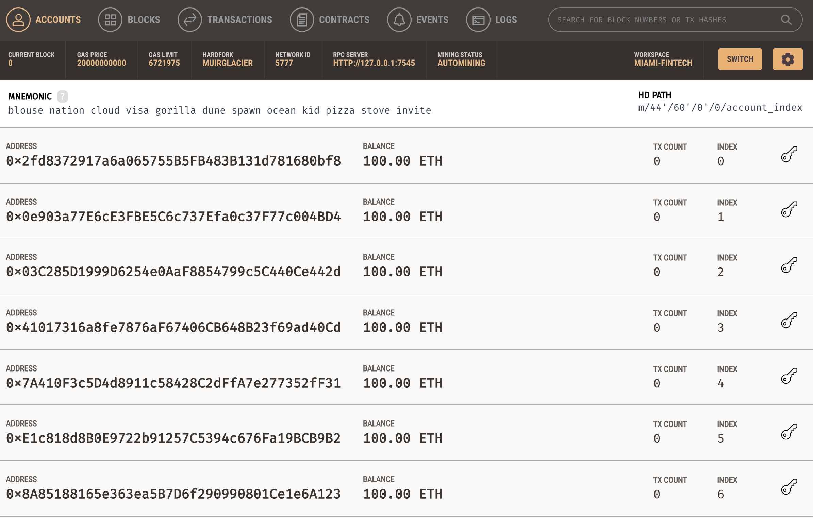
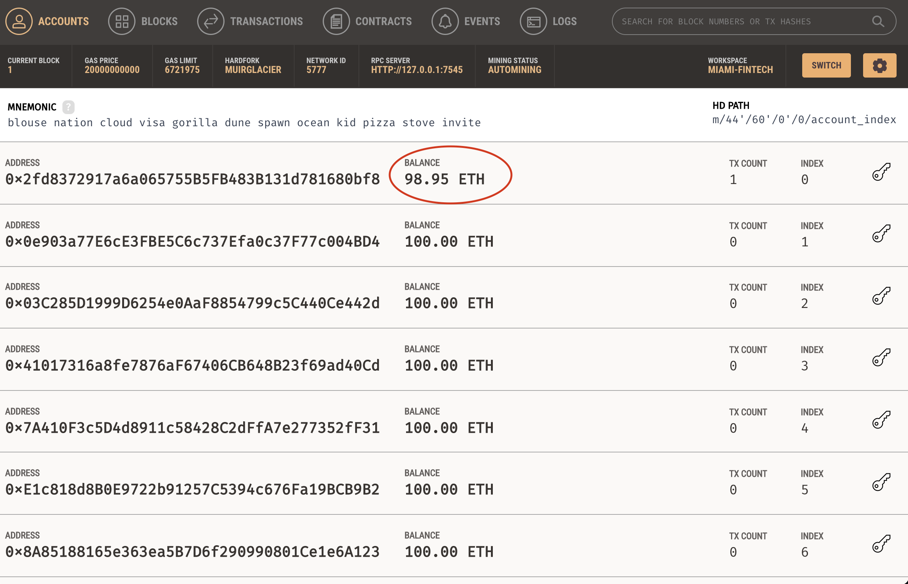
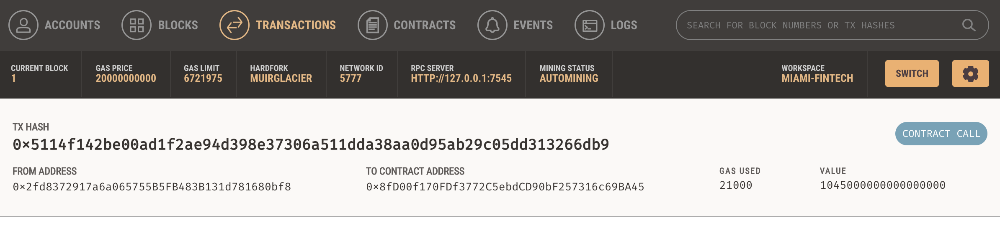
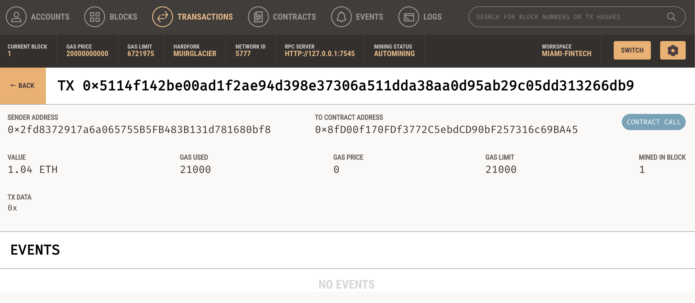

# Cryptocurrency_Wallet
Fintech Finder is an application that its customers can use to find fintech professionals from among a list of candidates, hire them, and pay them.

### Project Background

For this project, I will be building a new and disruptive platform called Fintech Finder. Fintech Finder is an application that its customers can use to find fintech professionals from among a list of candidates, hire them, and pay them. I will be integrating the Ethereum blockchain network into the application in order to enable customers to instantly pay the fintech professionals whom they hire with cryptocurrency.

To complete this project, I will develop and test the code that enables customers to send cryptocurrency payments to fintech professionals. I will test the code by assuming the perspective of a Fintech Finder customer who is using the application to find a fintech professional and pay them for their work.

### PY Files Created

I will code and complete two Python files, `fintech_finder.py` and `crypto_wallet.py`.

`fintech_finder.py` contains the code associated with the web interface of the application, and is compatible with the Streamlit library.

`crypto_wallet.py` contains the Ethereum transaction functions. Utilizing import statements, I will integrate the `crypto_wallet.py` Python script into the Fintech Finder interface program that is found in the `fintech_finder.py` files, which will automate the tasks associated with generating a digital wallet, accessing Ethereum account balances, and signing and sending transactions via a personal Ethereum blockchain called Ganache.

Specifically, the following tasks were performed to complete the Fintech Finder application:

* Generate a new Ethereum account instance by using the mnemonic seed phrase provided by Ganache.

* Fetch and display the account balance associated with an Ethereum account address.

* Calculate the total value of an Ethereum transaction, including the gas estimate, that pays a Fintech Finder candidate for their work.

* Digitally sign a transaction that pays a Fintech Finder candidate, and send this transaction to the Ganache blockchain.

* Review the transaction hash code associated with the validated blockchain transaction.

#### Inspect the Transaction

The following activities were performed to test the Fintech Finder application:

* Launch the Streamlit application from terminal, using `streamlit run fintech_finder.py`.

* On the resulting webpage, select a candidate that you would like to hire from the appropriate drop-down menu. Then, enter the number of hours that you would like to hire them for.

* Click the Send Transaction button to sign and send the transaction with your Ethereum account information. Navigate to the Transactions section of Ganache.

    * Screenshot of the address balance and history on Ganache. 
    
 

    * Screenshot of the transaction details on Ganache. 
    

5. Return to the original transaction, and click the transaction’s To address.

    * Screenshot of the recipient’s address balance and history from your Ganache application.

---

